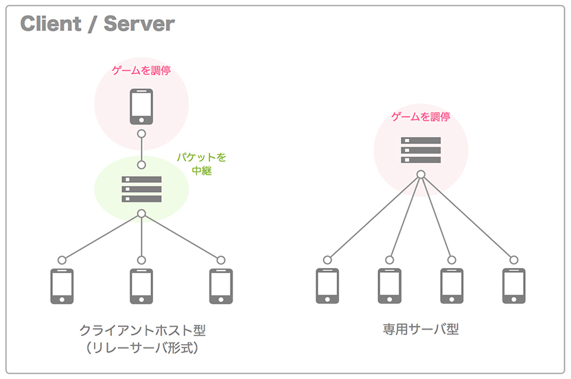
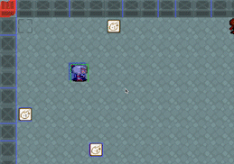

# Recursion 上級者チーム開発 12/16 ~ 01/28 - Team-v

## 成果物

- [ボムボムパニック](https://bombompanic.vercel.app/)


- [Github](https://github.com/recursion-team-v/bomb)
- [Discord](https://discord.com/channels/684232065423900721/1051945817285599306)

---

## 概要

今回の要件はブラウザ上で動作するボンバーマンのようなオンライン対戦型ゲームを開発する事であり、ゲームの基本的な概要は、

- 爆風や敵キャラにタッチした場合死亡する
- 初期段階では、一回における爆弾は１つ、爆風は上下左右に１マス
- ブロックを爆風で破壊して以下のアイテムを取得できる、
  - ボムアップ：１回に置ける爆弾が１つ増える
  - ファイヤーアップ：爆風が１マス増える
  - スピードアップ：移動速度が早くなる

実装内容は各チームによって異なり、主に以下の三つのレベルを参考に取り組みます。

1. 初心者レベル

- オンライン対戦は実装せず、ボンマーマンゲームの基本的な概要のみの機能実装を目標とする

2. 中級者レベル

- オンライン対戦は実装せず、CPU のアルゴリズム強化や、ユーザ登録の機能実装を目標とする
- また、クリアするごとにステージが広くなったり敵キャラが強くなったりする機能の追加

3. 上級者レベル

- オンラインでのリアルタイム対戦の機能実装を目標とする
- ロビーを作成して、そのロビーに参加するためのコード発生機能また公開ロビー検索などの実装

Team-v はオンラインでのリアルタイム対戦の実装を最優先とし、CPU なども追加していく事を目標としました。

---

## 議事録

### 12/16 - 開発環境の構築

**やったこと**

オンライン対戦の実装にサーバとクライアントが必要な為、モノレポで frontend と backend を管理し、frontend は React + Vite と TypeScript を使用。backend はコンパイル言語である Go を推奨していたが、リアルタイムゲームサーバのフレームワークが少ない事とクライアントとの相性が悪い理由として Node.js に変更。また、最低限の CI（github actions）として eslint + prettier を main へ対するプルリク時に実行させる様にした（関連 Issue: [最低限の ci を用意する #4](https://github.com/recursion-team-v/bomb/issues/4)）。

**直面した問題**

- CI で prettier が変更内容を自動的に commit してくれず（おそらくレポへ対する権限の問題）、 CI を管理するするボットを contributor として追加し、そのアカウント情報を commit 時に設定する事で解決

```yml
prettier:
  runs-on: ubuntu-latest
  ....
    - name: commit and push
      uses: EndBug/add-and-commit@v9.1.1
      with:
        message: "refactor: format code"
        committer_name: "github-actions[bot]" # 追加したボットアカウントの情報
        committer_email: "41898282+github-actions[bot]@users.noreply.github.com"
        push: true
```

**課題**

- ゲームエンジン（衝突判定・動作などの機能）の選定
- リアルタイムゲームサーバのフレームワークの選定
- ホスティング環境の選定

<br />

### 12/21 - 技術スタックの候補

**やったこと**

ホスティング環境は frontend と backend で以下を使用することにした。

- frontend:
  - vercel
- backend:
  - リアルタイムゲームサーバとしてレイテンシ（遅延）を最小限に抑える事が必須であったため、各サービスのレイテンシを [Cloud Ping Test](https://cloudpingtest.com/) を使って比較し、結論無料枠で使える GCP Cloud Run を使用（関連 Issue: [hosting 環境を決める #5](https://github.com/recursion-team-v/bomb/issues/5)）。

ゲーム機能の実装に必要なゲームエンジンの候補として、

- [PixiJS](https://pixijs.com/)
- [Phaser](https://phaser.io/phaser3)

リアルタイムゲームサーバのフレームワークの候補として、

- [geckos.io](https://geckos.io/)
  - WebRTC ベースで早いが、UDP をフルオープンにする都合上 VM が必要（マネージドサービスとの相性が悪い）
- [colyseus.io](https://www.colyseus.io/)
  - Node.js と websocket ベースのリアルタイムゲーム通信フレームワーク

**課題**

- 上記の候補を検証する

<br />

### 12/23 - 技術スタックの選定

**やったこと**

以下の様にゲームエンジンの比較を行い、結論 Phaser を使用。

- PixiJS
  - ドキュメントが少ないし、使っている記事も古いのが多い
  - 描画のみ行えるフレームワーク
  - rendering がそもそも大変で、キャラを移動させる方法もよくわからなかった
- Phaser
  - ドキュメントや事例が多い
  - 今回のゲームに必要である衝突判定・動作などが組み込まれている

一般的なゲームのサーバ・クライアントアーキテクチャを参考とし（下図の右）、

1. サーバでゲームをホストして、ゲーム内のロジック（衝突判定、プレイヤー動作）、状態（時間、爆弾の位置、アイテムの位置など）を管理する。その際、ゲームの物理エンジンをサーバでも持つ必要があるため、[Matter.js](https://brm.io/matter-js/) という物理エンジンを Phaser と共に使用（関連 Issue: [example: phaserjs #27](https://github.com/recursion-team-v/bomb/issues/27)）。
2. クライアントはプレイヤーのキーの入力や情報をサーバに送り、サーバがそれを検証してその結果をクライアントに返す



また、このアーキテクチャは Authoritative Server とも呼ばれ、クライアント側を信頼せずに全てサーバ側で管理するという意味ではチート防止などにも役立つ。

**課題**

- 一旦、通信は後回しにしてフロントエンドで全部動かす。できてから、バックエンドや共通ライブラリに切り分ける。
  - キャラを動かせる
  - ステージがある
  - 壁がある
  - 爆弾が置ける
  - 爆弾が爆発する
  - アイテムが取れる

<br />

### 12/31 - サーバに Colyseus と Matter.js を追加

**やったこと**



- プレイヤーと壁・爆風の衝突判定の実装
  - Matter.js の ```collisionStart``` イベントを使って以下の考えられる衝突の組み合わせを実装
```
    player - item
    player - bomb
    player - explosion
    player - wall
    player - block(破壊できる)
    player - player
    bomb - item
    bomb - wall
    bomb - block
    bomb - bomb
    bomb - explosion
    item - wall ?
    item - block ?
    item - explosion
```
- サーバでのプレイヤー動作の実装
- サーバ・クライアントで秒間 60 回の更新（60FPS）

**直面した問題**
- Matter.js の衝突判定の callback に渡される引数の型が不明である（関連 Issue: [Game: 衝突判定 #50](https://github.com/recursion-team-v/bomb/issues/50)）
- サーバでプレイヤー動作を管理しているため、クライアントでのプレイヤーの移動がスムーズじゃない
  - クライアント側で線形補間を使用してプレイヤーの位置を予測することで、プレイヤーの移動をスムーズにし、より連続的に描画できる様にした
  
```ts
this.x = Math.ceil(Phaser.Math.Linear(this.x, this.serverX, 0.35));
this.y = Math.ceil(Phaser.Math.Linear(this.y, this.serverY, 0.35));
```

**課題**

- 爆弾・爆風の実装
- アイテムの実装

<br />

### 01/07 - 

**やったこと**

今まで一旦クライアントで実装していた以下をサーバ側で管理する様にした。
- ゲーム進行時のタイマー（関連 pull request: [タイマーをサーバ側に寄せた #98
](https://github.com/recursion-team-v/bomb/pull/98)）
- マップの生成（ブロックの配置）（関連 pull request: [#75 feat: generate map on server #85
](https://github.com/recursion-team-v/bomb/pull/85)）
- ボムの設置（関連 pull request: [サーバ側で爆発を追加 #133
](https://github.com/recursion-team-v/bomb/pull/133)）
- アイテムの配置（関連 pull request: [サーバー側にアイテムを設置 #130
](https://github.com/recursion-team-v/bomb/pull/130)）

**直面した問題**
- 爆弾の同期
- 誘爆の処理
